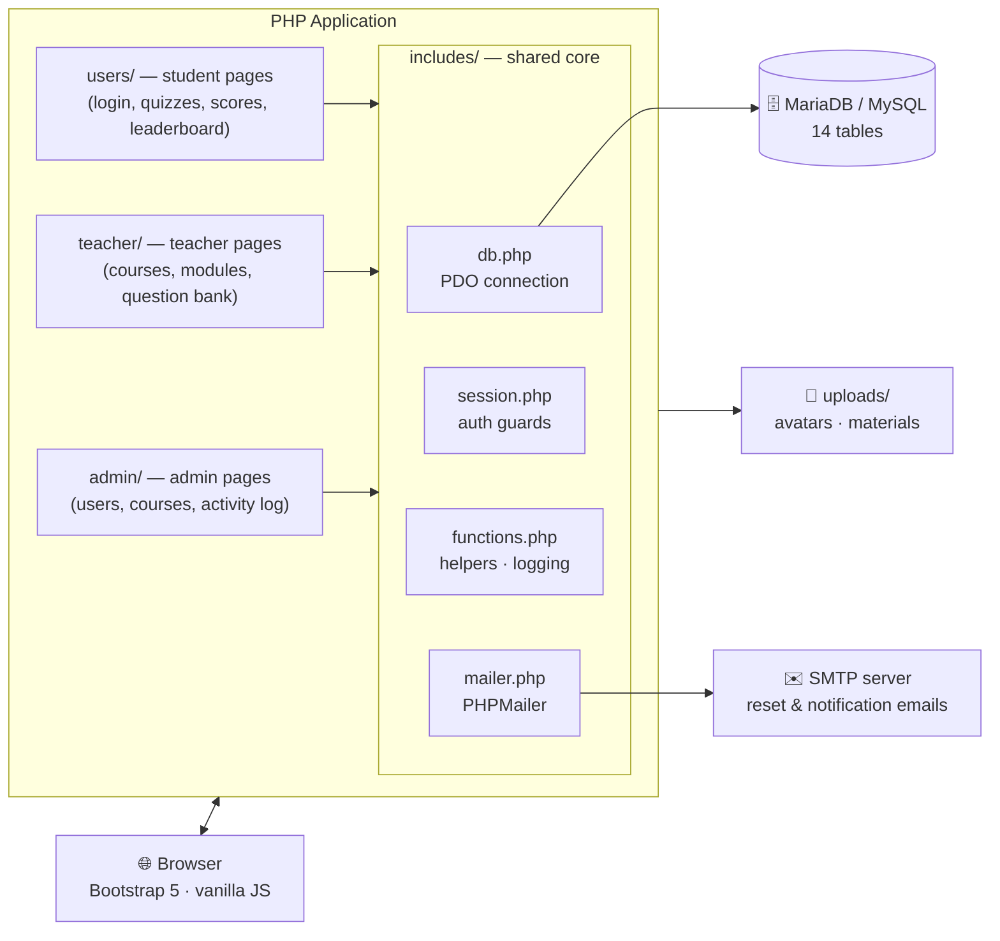
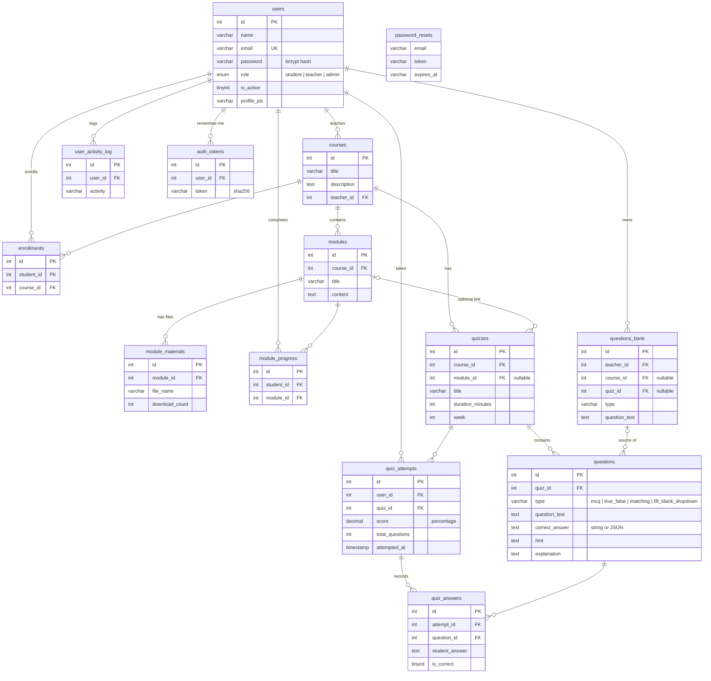

# 🎓 EduLearn — E-Learning Platform


A complete e-learning web application built with **plain PHP + PDO** — no framework. It provides a full ecosystem for online education with three distinct roles (**Admin**, **Teacher**, **Student**), a quiz engine with four question types, a reusable question bank, file-based course materials, progress tracking, leaderboards, and CSV/PDF exports.

---

## Table of Contents

- [Features](#-features)
- [Architecture](#-architecture)
- [Database Schema](#-database-schema)
- [Quiz Engine](#-quiz-engine)
- [Getting Started](#-getting-started)
- [Demo Accounts](#-demo-accounts)
- [Configuration Reference](#-configuration-reference)
- [Security](#-security)
- [Project Structure](#-project-structure)

---

## 🌟 Features

### 🧑‍🎓 Student
- Personal dashboard with recent scores and active courses
- Browse & enroll in courses, read modules, download materials
- Take timed quizzes (four question types) — one attempt per quiz
- Review answers with hints & explanations after submission
- Per-quiz leaderboards with score and completion-time ranking
- Track module completion progress per course
- Export scores as **PDF** (TCPDF) or **CSV**
- Profile management: avatar upload, password change, activity log

### 👨‍🏫 Teacher
- Create and manage courses, modules, and file materials (PDF, DOCX, PPTX, images)
- Build quizzes and attach them to courses/modules with a duration limit
- **Question Bank**: reusable personal question library with CSV import/export, usage statistics, and one-click "add to quiz"
- Monitor student progress per course (modules completed per student)
- Quiz analytics: attempts and average score per quiz, exportable as CSV

### 🛡️ Admin
- Full user management: edit, activate/deactivate, delete, bulk actions
- Manage all courses and reassign teachers
- System-wide activity log with search and CSV export
- Dashboards with monthly growth and top-quiz statistics

---

## 🏗 Architecture

EduLearn is a classic **server-rendered multi-page application**. Every page is a self-contained PHP script that authenticates the session, runs its own SQL through a shared PDO connection, and renders HTML with Bootstrap 5.



**Request lifecycle** (every page follows the same pattern):

1. `session_start()` + role guard from `includes/session.php` — redirects if the visitor isn't logged in or has the wrong role.
2. `includes/db.php` loads `.env` (phpdotenv) and opens a **PDO** connection with exceptions enabled.
3. The page runs its queries with **prepared statements** and renders HTML through the shared `templates/header.php` / `footer.php`.
4. Mutations (user edits, deletions, enrollments) are recorded in `user_activity_log` via `log_activity()`.

---

## 🗄 Database Schema

The full schema lives in [`schema.sql`](schema.sql) — import it once and you get all 14 tables, foreign keys, seed demo accounts, and a trigger that keeps `quizzes.teacher_id` in sync with the owning course.



Design notes:

- **Cascading deletes** — removing a user or course automatically cleans up enrollments, attempts, answers, and progress rows.
- **Compatibility virtual columns** — a few pages historically used alternate column names (`courses.name`, `enrollments.user_id`, `quiz_answers.selected_answer`). The schema exposes these as generated aliases of the real columns so every page works against one source of truth.
- **`module_progress`** has a composite `UNIQUE(student_id, module_id)` so marking a module complete is idempotent (`INSERT IGNORE`).

---

## 🧠 Quiz Engine

| Type | Stored as | Graded by |
|---|---|---|
| **Multiple choice** (`mcq`) | option text in `correct_answer` | exact string match |
| **True / False** (`true_false`) | `True` / `False` | exact string match |
| **Matching** (`matching`) | JSON array of `{left, right}` pairs | every pair must match (case-insensitive) |
| **Fill-in-the-blank** (`fill_blank_dropdown`) | JSON array of correct picks; blanks written inline as `[opt1\|opt2\|opt3]` | every blank must match |

Submission (`users/submit_quiz.php`) grades server-side, stores the attempt score as a percentage, and records every individual answer in `quiz_answers` for later review — students can revisit any attempt with hints and explanations, teachers see aggregate analytics, and the leaderboard ranks by score, then completion time.

---

## 🚀 Getting Started

### Prerequisites

- **PHP 8.0+** with `pdo_mysql`, `mbstring`, `gd`, `zip`
- **MariaDB 10.5+ / MySQL 8** (MariaDB 12 tested)
- **Composer**

### 1. Clone & install dependencies

```bash
git clone https://github.com/pchrysostomou/e-learning-platform.git
cd e-learning-platform
composer install
```

### 2. Configure the environment

Create a `.env` file in the project root (see the [full reference](#-configuration-reference) below):

```env
DB_HOST=localhost
DB_NAME=elearning
DB_USER=root
DB_PASS=
DB_CHARSET=utf8mb4

BASE_URL=http://localhost:8000

SMTP_HOST=smtp.example.com
SMTP_USER=you@example.com
SMTP_PASS=your_app_password
SMTP_PORT=587
SMTP_FROM_EMAIL=you@example.com
SMTP_FROM_NAME="EduLearn"
```

### 3. Create the database

```bash
mysql -u root -e "CREATE DATABASE elearning CHARACTER SET utf8mb4 COLLATE utf8mb4_unicode_ci;"
mysql -u root elearning < schema.sql
```

`schema.sql` creates all tables **and** seeds the [demo accounts](#-demo-accounts).

### 4. Run

```bash
php -S localhost:8000
```

Open **http://localhost:8000** and sign in.

> **Windows shortcut:** `start-app.bat` starts MariaDB (if it isn't running as a service) and the PHP dev server in one double-click.

---

## 👤 Demo Accounts

| Role | Email | Password |
|---|---|---|
| 🛡️ Admin | `admin@elearning.local` | `admin123` |
| 👨‍🏫 Teacher | `teacher@elearning.local` | `teacher123` |
| 🧑‍🎓 Student | `student@elearning.local` | `student123` |

> Change or remove these before any non-local deployment.

---

## ⚙️ Configuration Reference

| Variable | Purpose |
|---|---|
| `DB_HOST` / `DB_NAME` / `DB_USER` / `DB_PASS` | MySQL/MariaDB connection |
| `DB_CHARSET` | Connection charset — use `utf8mb4` |
| `BASE_URL` | Absolute base URL used to build every link and redirect |
| `SMTP_HOST` / `SMTP_PORT` | Mail server (STARTTLS) for password-reset emails |
| `SMTP_USER` / `SMTP_PASS` | SMTP credentials |
| `SMTP_FROM_EMAIL` / `SMTP_FROM_NAME` | Sender identity on outgoing mail |

The app runs fine without a real SMTP server — email sending fails silently (logged to `logs/app_errors.log`); only "forgot password" emails are affected.

---

## 🛡 Security

- **Passwords** are hashed with `password_hash()` (bcrypt) — never stored in plain text.
- **All SQL** goes through PDO **prepared statements**.
- **Role guards** on every page; students, teachers, and admins cannot reach each other's routes.
- **Remember-me tokens** are stored as SHA-256 hashes; the plain token lives only in the user's cookie.
- **Password resets** use single-use, 30-minute random tokens (64 hex chars).
- **File uploads** are validated by extension and size (10 MB max) and renamed with `uniqid()` before storage.
- **Secrets** live in `.env`, which is git-ignored — commit `.env.example`-style documentation, never credentials.

---

## 📂 Project Structure

```
e-learning-platform/
├── index.php                 # Entry point — routes by role
├── schema.sql                # Full database schema + demo seed
├── start-app.bat             # Windows one-click launcher (DB + PHP server)
├── admin/                    # Admin dashboard, user/course management, logs, exports
├── teacher/                  # Course/module/quiz management, question bank
├── users/                    # Auth pages + student experience (quizzes, scores, leaderboard)
├── includes/                 # Shared core: db.php, session.php, functions.php, mailer.php
├── templates/                # header / footer / sidebar partials
├── assets/                   # Custom CSS & JS
├── bootstrap/                # Bootstrap 5 (vendored)
├── uploads/                  # User content: profile_pics/, materials/  (git-ignored)
├── logs/                     # Application error log                    (git-ignored)
└── vendor/                   # Composer packages                        (git-ignored)
```

**Key libraries** (managed by Composer): [vlucas/phpdotenv](https://github.com/vlucas/phpdotenv) · [PHPMailer](https://github.com/PHPMailer/PHPMailer) · [TCPDF](https://github.com/tecnickcom/TCPDF) · [PhpSpreadsheet](https://github.com/PHPOffice/PhpSpreadsheet)
